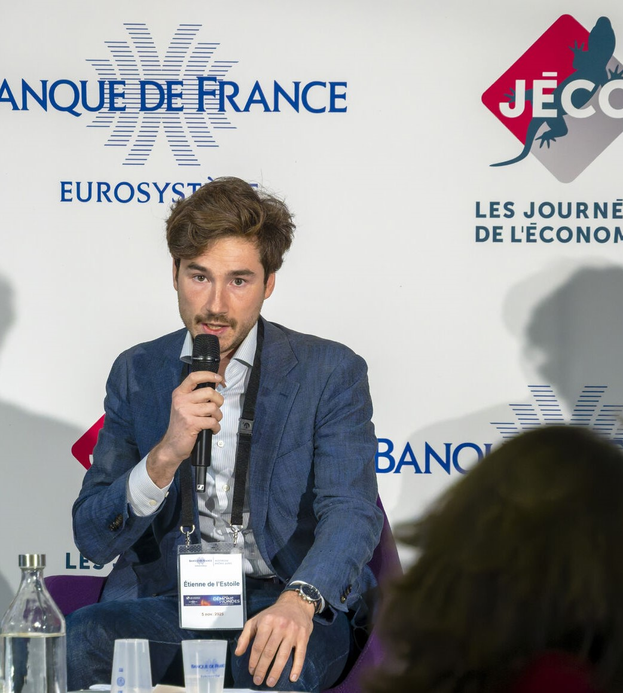

<!-- COVER -->

  

<!-- PROFILE BLOCK (PHOTO + NOM) -->

  

    
  

  
Etienne de L'Estoile

<!-- DESCRIPTION (sous la cover) -->

  
<strong>Climate & Macroeconomics Economist</strong> 
     Macroprudential Policy and Financial Stability Division, Banque de France 
     PhD in Economics, Paris 1 Panthéon-Sorbonne
  

<nav class="site-nav">
  <a href="/">Home</a>
  <a href="/research">Research</a>
  <a href="/outreach">Outreach</a>
</nav>

# About Me

I am an Economist in the Macroprudential Policy and Financial Stability Division at the Banque de France and hold a PhD in Economics from Paris 1 Panthéon-Sorbonne.  
My work focuses on the intersection of <strong>climate risks, macro-financial stability, and data-intensive modelling</strong>.

I develop empirical tools to quantify the exposure of firms, banks, and economic systems to environmental shocks, using high-resolution physical risk data, geospatial information, and granular balance-sheet microdata. My research is applied, policy-relevant, and aims to inform central banks, regulators, and institutions about emerging climate vulnerabilities.

---

## Research Interests

- Climate–macro linkages and environmental shocks  
- Natural disaster impacts & physical risk modelling  
- Macroprudential policy & financial stability  
- Commercial real estate & land-use economics  
- Spatial econometrics & geospatial modelling  

---

## Author Webpages

- <a href="https://www.banque-france.fr/fr/etienne-de-lestoile">Banque de France</a>  
- <a href="https://shs.cairn.info/publications-de-etienne-de-lestoile--699197?lang=fr">Cairn</a>

